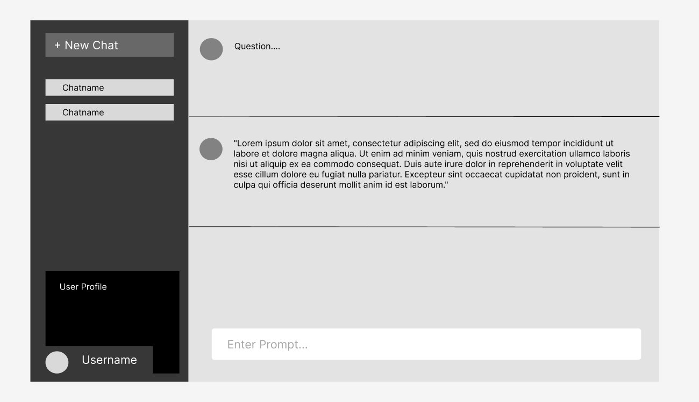
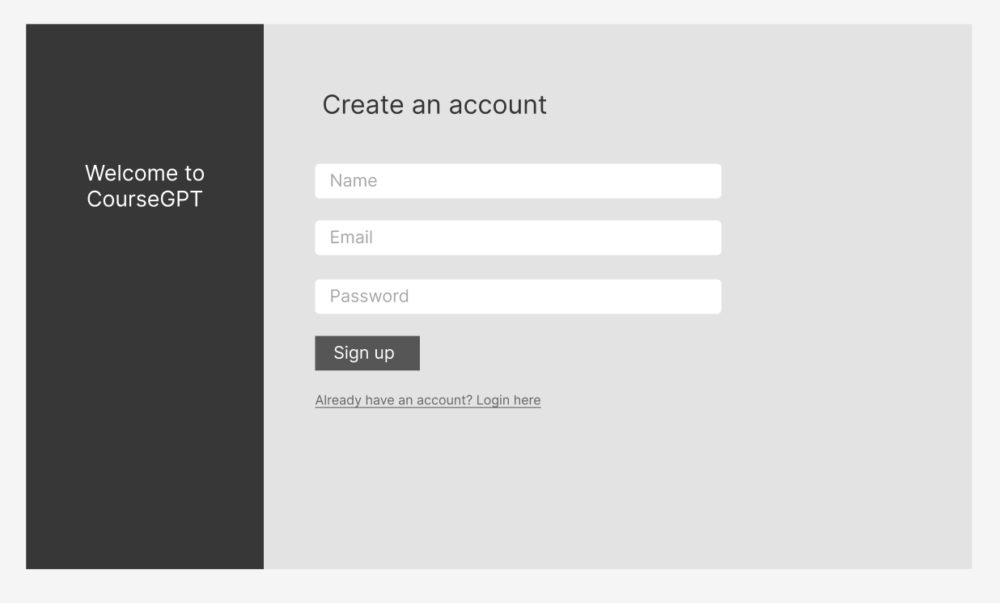

# CourseGPT

Unlock the potential of personalized education with [CourseGPT](https://course-gpt.herokuapp.com/) - an AI-powered proffesor at your service.

CourseGPT allows professors to train custom AI models on demand, acting as a virtual tutor available 24/7 to students. By providing immediate access to tailored course content, it enhances student learning while significantly reducing professors’ administrative workload.

---

## Project Progress 1

### Group Members

- Carolyn Huang
- Ritik Keswani
- Kyle Rich
- Duffy Du
- Amy Jo

### Brainstorming

- Kickstarter clone
- Price tracker (Amazon, etc.)
- Data visualization Website (of some random USA data)
- Algorithm visualization App
- Automated Google Calendar Scheduling
  - Automatically schedule tasks according to effort level, importance, soft
    deadline, and hard deadline
- Gamified Social Habit Tracker
- CourseGPT <-- Chosen

## Project Description

CourseGPT is an educational app designed to support students by providing on-demand access to their course information. It offers an interface for students to ask questions related to course content and receive informative replies.

#### Who is it for?

CourseGPT facilitates students' access to all of their course information and lessons. Not only does this support student learning, but it also alleviates professor workload.

#### What will it do? (What "human activity" will it support?)

CourseGPT will provide students an interface to ask questions about course
information and content - similar to a personal tutor who has in-depth knowledge
about the courses the student is taking.

#### What type of data will it store?

The primary schemas include: Users, Schools, Courses, Chats, Messages, and
Feedback.
Please see [the models folder](server/models). There are additional schemas
and fields necessary to complete the stretch goals.

#### What will users be able to do with this data?

They will be able to select a school and a course that they are interested in
learning about and begin asking questions to CourseGPT. They will also be able
to view their chat history, delete chatIds or messages, and copy and paste the
chat messages to share with friends. Additionally, they can report errors and
give feedback on CourseGPT responses so that developers can improve the
model. They can also change their user profile by editing their email and
password.

#### What is some additional functionality you can add/remove based on time constraints?

This question is implicitly answered by
the [requirements](#Project-Task-Requirements) below. The objective is to
provide at least the [minimal requirements](#Minimal-Requirements),
and hopefully most, if not all, of the
[standard requirements](#Standard-Requirements). We will add or remove features
within the [standard requirements](#Standard-Requirements) and
[stretch requirements](#Stretch-Requirements) according to relative importance
and time constraints.

### Project Task Requirements

#### Minimal Requirements

1. **Simple user login**
   - As a user, I want to be able to create an account and log in
     so that I can access CourseGPT.
2. **Being able to ask questions (1 course supported)**
   - As a student user, I want to be able to ask questions and
     receive answers for at least one supported course so that I can understand
     the course content better.
3. **Chat history (view)**
   - As a student user, I want to be able to view my past chatIds so
     that I can review the information that I've learned.

#### Standard Requirements

1. **Deleting chat history**
   - As a student user, I want to be able to clear my chat history
     so that I can keep my chat interface focused on my current
     learning goals.
2. **Feedback on individual messages**
   - As a user, I want to be able to provide feedback on each
     response from CourseGPT so that I can help the developers improve
     CourseGPT
     and further my learning.
3. **Favourite courses**
   - As a student user, I want to be able to favorite courses and
     have them easily selectable when creating a new chat so that I can quickly
     access the courses I'm currently studying. Although I recognize that only
     one course will be significantly trained and useful.
4. **Suggested prompt generation**
   - As a student user, I want to have suggested prompts based on
     my selected course so that I can get ideas for what questions to ask or
     topics to explore.
5. **ProfileSettings changes**
   - As a user, I want to be able to edit my email and password in my profile
     settings so that I can keep my account information up to date.

#### Stretch Requirements

1. **Professor improved CourseGPT model**
   - As a professor user, I want to be able to upload PDF documents
     that provide more information for training my course
     so that CourseGPT can provide more helpful answers to students.
2. **Professor new CourseGPT model**
   - As a professor user, I want to be able to upload PDF documents
     that will be used to create and train a new course so that
     students in my course can utilize ChatGPT.
3. **Admin/Developer dashboard**
   - As an admin, I want to have a dashboard that provides an
     overview of usage statistics, such as the number of users, number
     of questions asked, and most popular courses, so that I can understand how
     the system is being used and make data-driven decisions about how to
     improve it.
4. **Community feature**
   - As a student user, I want to be able to see popular questions
     asked by other students for a certain course and answers endorsed by
     instructors so that I can learn more from other student usage and what my
     instructors believe to be important.
5. **Usage Analytics**
   - As a developer for CourseGPT, I want to have easy
     access to detailed data related to each course, such as popular questions
     and answers, feedback on messages, and other relevant data points so that
     I can analyze user behavior and CourseGPT's performance and
     improve the models for each course, further increasing user satisfaction
     and learning.
6. **Multiple Course Support**
   - As a student user, I want to be able to select multiple different courses
     and receive helpful assistance in all of them so that I can learn more
     about all the courses I am taking, rather than just one.
7. **Chat Search Functionality**
   - As a student user, I want to be able to access a search bar to search
     through all of my chatIds to easily locate information so that I can
     efficiently find the information I need without having to scroll through
     all my chatIds.

### Task Breakdown

#### Simple user login

- **"Create Account" and "Login" frontend pages**
  - Design and implement the frontend pages for
    creating a new account and logging in. These pages should include fields
    such as email and
    password.
- **Set up User API**
  - Set up endpoints in the backend to handle account creation and login
    requests.
  - Implement the logic for validating the input data and storing the user
    data in the database.
- **Set up User schema**
  - Define the UserSchema for MongoDB.

#### Being able to ask questions (1 course supported)

- **"Chat" page**
  - Design and implement the frontend page for course chatIds. This should
    include a user input field and a conversation-like interface.
- **Set up Chat and Message API**
  - Set up endpoints in the backend to handle chat and chat message requests.
  - Implement the logic for responding with CourseGPT and storing the chatIds
    and messages in the database.
- **Set up Chat and Message schemas**
  - Define the ChatSchema and MessageSchema for MongoDB.
- **Data generation for CourseGPT training**
  - Generate a list of questions and answers related to one UBC course. Use
    this data to train the CourseGPT model.
- **Model training**
  - Implement the logic for training the CourseGPT model based on the training
    data.

### Prototypes

Task: User can ask questions and the app will provide responses

Task: User can create a new account

Refer to above for prototypes of our app. Or navigate to our [deployed version](https://course-gpt.herokuapp.com/)

---

## Project Progress 4

### COMPLETE

#### Minimal Requirements [ COMPLETE ]

1. **Simple user login**
   - As a user, I want to be able to create an account and log in
     so that I can access CourseGPT.
2. **Being able to ask questions (1 course supported)**
   - As a student user, I want to be able to ask questions and
     receive answers for at least one supported course so that I can understand
     the course content better.
3. **Chat history (view)**
   - As a student user, I want to be able to view my past chatIds so
     that I can review the information that I've learned.

#### Standard Requirements [ COMPLETE ]

1. **Deleting chat history**
   - As a student user, I want to be able to clear my chat history
     so that I can keep my chat interface focused on my current
     learning goals.
2. **Feedback on individual messages**
   - As a user, I want to be able to provide feedback on each
     response from CourseGPT so that I can help the developers improve
     CourseGPT
     and further my learning.
3. **Favourite courses**
   - As a student user, I want to be able to favorite courses and
     have them easily selectable when creating a new chat so that I can quickly
     access the courses I'm currently studying. Although I recognize that only
     one course will be significantly trained and useful.
4. **Suggested prompt generation**
   - As a student user, I want to have suggested prompts based on
     my selected course so that I can get ideas for what questions to ask or
     topics to explore.
5. **ProfileSettings changes**
   - As a user, I want to be able to edit my email and password in my profile
     settings so that I can keep my account information up to date.

#### Stretch Requirements [ COMPLETE ]

1. **Professor improved CourseGPT model**
   - As a professor user, I want to be able to upload text
     that provides more information for training my course
     so that CourseGPT can provide more helpful answers to students.

### IN PROGRESS

#### Stretch Requirements [ IN PROGRESS ]

1.  **Multiple Course Support**

    - As a student user, I want to be able to select multiple different courses
      and receive helpful assistance in all of them so that I can learn more
      about all the courses I am taking, rather than just one.

2.  Developer/Admin Analytics Page

    - As an admin/developer user, I want an enhanced analytics page
      providing data related to popularity, feedback, and gapair, so that
      I can have a comprehensive understanding of user interactions and
      optimize the platform accordingly.

3.  **Chat Search Functionality**
    - As a student user, I want to be able to access a search bar to search
      through all of my chatIds to easily locate information so that I can
      efficiently find the information I need without having to scroll through
      all my chatIds.

#### Requirements Added Mid-Project [ IN PROGRESS ]

1. **Improved Profiles Modal**

   - As a user, I want a polished and user-friendly profiles modal so
     that I can easily navigate and manage my profile.

2. **Copy to Clipboard Functionality**
   - As a user, I want to be able to easily copy Course GPT messages to my clipboard,
     enabling me to easily share or save important information.

### DEEP BACKLOG / WILL NOT COMPLETE

#### Stretch Requirements [ DEEP BACKLOG / WILL NOT COMPLETE ]

1. **Professor new CourseGPT model**

   - As a professor user, I want to be able to upload PDF documents
     that will be used to create and **train a new course** so that
     students in my course can utilize ChatGPT.

2. **Community feature**
   - As a student user, I want to be able to see popular questions
     asked by other students for a certain course and answers endorsed by
     instructors so that I can learn more from other student usage and what my
     instructors believe to be important.

#### Requirements Added Mid-Project [ DEEP BACKLOG / WILL NOT COMPLETE ]

1. **Email Confirmation**

   - As a new user, I need to confirm my email to ensure the authenticity
     of my account so that unauthorized access can be minimized.

2. **Share Conversation Feature**

   - As a user, I want to have a share button for each conversation
     so that I can easily share valuable insights with others.

3. **Separate Filtering Functionality**

   - As a user, I want filtering functionality to be separated from
     creating a new chat so that I can manage my conversations more
     efficiently.

4. **Format Code Answers of Bot**

   - As a user, I want the code answers from the bot to be formatted properly
     so that I can easily understand and learn from them.

5. **User Request Limit Per Hour**

   - As an admin, I want a limit to the number of requests a user can make
     per hour to maintain system stability and prevent misuse.

6. **Individual Chat Deletion Confirmation**
   - As a user, I want a confirmation button when I attempt to delete a chat
     to prevent accidental deletions and data loss.
